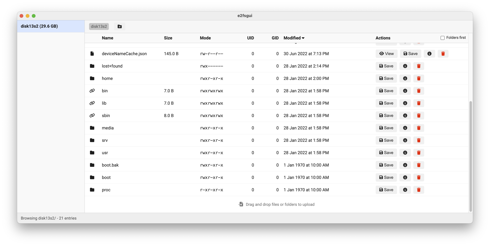

<p align="center">
  
</p>

# e2fsgui (macOS)

<p align="center">
  
</p>

**Problem:** Accessing Linux `ext2/3/4` filesystems on macOS often requires commercial software (like Paragon) or complex setups involving system extensions and background daemons (like macFUSE). There isn't a simple, standalone app just for quickly browsing and copying files without persistent background daemons.

**Solution:** `e2fsgui` is a lightweight, user-friendly Electron app that lets you **browse, read, copy, upload, create directories, and delete files/directories** from Linux disks directly on your Mac. No complex setups, just plug in your disk and go!

Built using `e2fsprogs` (via Homebrew) for reliability.

## Features

*   Automatically detects ext2/3/4 partitions plugged into your Mac, **and dynamically scans for changes** (new drives plugged in or removed).
*   Browse directories, preview sizes, sort by name/size/mode/owner/modified date.
*   Copy out individual files **or whole directories** to your macOS file‑system preserving ownership.
*   **Upload files and directories** from your Mac to the Linux filesystem (drag and drop).
*   **Create new directories** within the Linux filesystem.
*   **Delete files and directories** (recursively for directories) within the Linux filesystem.
*   View basic file/inode information.
*   Preview text-based file content directly in the app.
*   No kernel extensions – works entirely through `debugfs` from **e2fsprogs** installed via Homebrew.
*   Built with **Vue 3** + **Electron**.

## Installation & Usage (End Users)

### Quick Install & Run (Recommended)

You can use the following command in your Terminal to automatically install dependencies (like Homebrew, e2fsprogs), download the latest release, and run the application:

```bash
curl -fsSL https://raw.githubusercontent.com/delaneyb/e2fsgui/main/run-latest.sh | bash
```

> **Security Note:** This command downloads and executes a script from the internet. The script will install Homebrew and `e2fsprogs` if they are missing, and then run the e2fsgui launcher, which will prompt for `sudo` access separately. Please review the [run-latest.sh](run-latest.sh) script yourself before running this command to ensure you trust its contents.

### Manual Installation

If you prefer not to use the automated script:

1.  **Prerequisites:**
    *   Ensure you have [Homebrew](https://brew.sh) installed.
    *   Install `e2fsprogs`: `brew install e2fsprogs`

2.  **Download:**
    *   Go to the [**Releases Page**](https://github.com/delaneyb/e2fsgui/releases).
    *   Download the latest `e2fsgui-vX.Y.Z.zip` file.
    *   Extract the ZIP archive (e.g., to your Downloads folder).

3.  **Run:**
    *   Open the **Terminal** app.
    *   Navigate into the extracted directory using `cd`. Example:
        ```bash
        cd ~/Downloads/e2fsgui-vX.Y.Z
        ```
        *(Replace `X.Y.Z` with the actual version number)*
    *   Run the application using `sudo`:
        ```bash
        sudo ./e2fsprogs
        ```
    *   Enter your macOS password when prompted.
    *   The e2fsgui application window will appear.

## Approach & Rationale (Root Access)

Directly reading raw disk devices (e.g., `/dev/disk2s1`) on macOS requires root privileges. While standard macOS apps use complex "Privileged Helper Tools" (installed via `SMJobBless`) to request this access with a native graphical prompt, this application uses a simpler approach:

**It must be run using `sudo` from the Terminal.**

**Why?**

*   **macOS Security:** Modern macOS (SIP, TCC) heavily restricts GUI applications attempting to escalate their *own* privileges to root using tools like `sudo-prompt`. These escalated processes run in a different security context and often cannot access necessary files (like `package.json`) or the user's original working directory, leading to `EPERM` or `uv_cwd` errors.
*   **Simplicity & Reliability:** Launching via `sudo` from the Terminal provides the necessary root privileges *and* the correct security context inherited from the user's shell session, avoiding these issues. This is the most reliable method without implementing a complex helper tool.

Therefore, this app is distributed as a simple ZIP archive containing the necessary Electron binary and source code, intended to be run directly via a `sudo` command.

## Getting Started (Developers)

```bash
# Install dependencies
npm install

# Start the app (requires root for disk access)
sudo npm start
# OR directly:
# sudo node_modules/.bin/electron .
```

The application expects the [Homebrew](https://brew.sh) package **e2fsprogs** to be installed:

```bash
brew install e2fsprogs
```

## Building a Release ZIP

To create a distributable ZIP archive for end-users:

```bash
# Ensure dev dependencies are installed
npm install

# Run the build script
npm run build:zip
```

This will:
1.  Create a `release/` directory.
2.  Copy the pre-built Electron application from `node_modules`.
3.  Place the necessary app source files (`main.js`, `index.html`, etc.) inside the Electron app bundle.
4.  Include `INSTRUCTIONS.md` for the user.
5.  Create a `e2fsgui-vX.Y.Z.zip` file in the `release/` directory.

The resulting ZIP file is the distributable release artifact.

## Folder Structure (Simplified)

```
├── index.html         # Renderer – Vue UI
├── main.js            # Electron main process
├── package.json       # Dependencies and scripts
├── build-zip.js       # Script to create release ZIP
├── INSTRUCTIONS.md    # Instructions for end-users (in release ZIP)
├── resources/
│   └── icon.icns      # App icon (used in ZIP)
└── .github/workflows/build.yml # GitHub Actions for building release ZIP
```

## License

This project is released under the MIT license.
