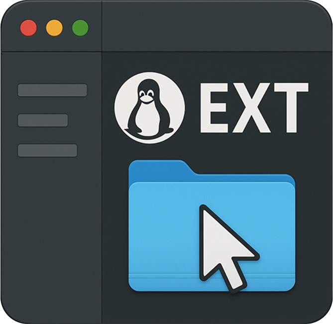

# e2fsgui (macOS)

<p align="center">
  
</p>

<p align="center"><b>Browse, read and rescue files from Linux ext2/3/4 disks on macOS</b></p>

<p align="center">
  
</p>

A lightweight Electron application to **browse, read and rescue files** from Linux ext2/3/4 disks on macOS using the `e2fsprogs` tool‑chain.

---

## Features

* Automatically detects ext2/3/4 partitions plugged into your Mac.
* Browse directories, preview sizes, sort by name/size.
* Copy out individual files **or whole directories** to your macOS file‑system preserving ownership.
* No kernel extensions – works entirely through `debugfs` from **e2fsprogs** installed via Homebrew.
* Built with **Vue 3** + **Electron**.

---

## Approach & Rationale (Root Access)

Directly reading raw disk devices (e.g., `/dev/disk2s1`) on macOS requires root privileges. While standard macOS apps use complex "Privileged Helper Tools" (installed via `SMJobBless`) to request this access with a native graphical prompt, this application uses a simpler approach:

**It must be run using `sudo` from the Terminal.**

**Why?**

*   **macOS Security:** Modern macOS (SIP, TCC) heavily restricts GUI applications attempting to escalate their *own* privileges to root using tools like `sudo-prompt`. These escalated processes run in a different security context and often cannot access necessary files (like `package.json`) or the user's original working directory, leading to `EPERM` or `uv_cwd` errors.
*   **Simplicity & Reliability:** Launching via `sudo` from the Terminal provides the necessary root privileges *and* the correct security context inherited from the user's shell session, avoiding these issues. This is the most reliable method without implementing a complex helper tool.

Therefore, this app is distributed as a simple ZIP archive containing the necessary Electron binary and source code, intended to be run directly via a `sudo` command.

---

## Getting Started (Developers)

```bash
# Install dependencies
npm install

# Start the app (requires root for disk access)
sudo npm start
# OR directly:
# sudo node_modules/.bin/electron .
```

The application expects the [Homebrew](https://brew.sh) package **e2fsprogs** to be installed:

```bash
brew install e2fsprogs
```

---

## Building a Release ZIP

To create a distributable ZIP archive for end-users:

```bash
# Ensure dev dependencies are installed
npm install

# Run the build script
npm run build:zip
```

This will:
1.  Create a `release/` directory.
2.  Copy the pre-built Electron application from `node_modules`.
3.  Place the necessary app source files (`main.js`, `index.html`, etc.) inside the Electron app bundle.
4.  Include `INSTRUCTIONS.md` for the user.
5.  Create a `e2fsgui-vX.Y.Z.zip` file in the `release/` directory.

The resulting ZIP file is the distributable release artifact.

---

## Folder Structure (Simplified)

```
├── index.html         # Renderer – Vue UI
├── main.js            # Electron main process
├── package.json       # Dependencies and scripts
├── build-zip.js       # Script to create release ZIP
├── INSTRUCTIONS.md    # Instructions for end-users (in release ZIP)
├── resources/
│   └── icon.icns      # App icon (used in ZIP)
└── .github/workflows/build.yml # GitHub Actions for building release ZIP
```

---

## License

This project is released under the MIT license.
